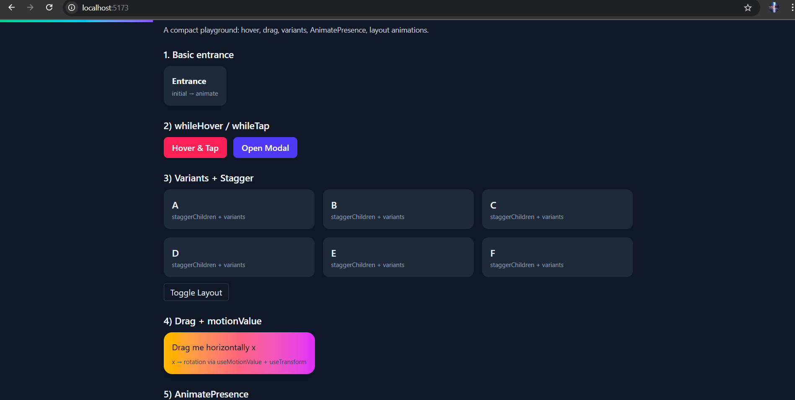
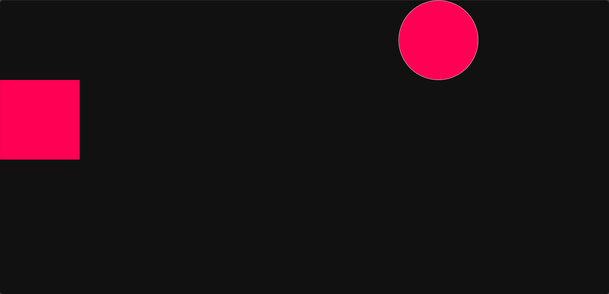

# Framer Motion Playground

A learning playground for exploring Framer Motion animations and React motion hooks through small, focused examples and notes.

## Purpose

This repository is a hands-on space for learning and experimenting with Framer Motion in React. It contains short examples, notes, and mini projects to help you understand both basic and advanced animation concepts in a practical way.

## Features

- Hands-on examples demonstrating single and composed animations
- Short notes and explanations for each topic
- Mini projects and small UI experiments to try ideas quickly
- Reusable snippets for transitions, gestures, layout animations, and more

## Technologies

- React
- Framer Motion
- Vite (development server)
- Node.js / npm (or yarn / pnpm)

## Quick setup (Windows PowerShell)

1. Pick a playground folder. Examples:

   - `framer_motion/`
   - `playground_part1/`
   - `playground_part2/`

2. Install deps and start the dev server (example uses `playground_part2`):

```powershell
cd playground_part2
npm install
npm run dev
```

Alternatives:

```powershell
# yarn
cd playground_part2; yarn; yarn dev

# pnpm
cd playground_part2; pnpm install; pnpm dev
```

Notes:

- If a project uses a different script name for the dev server, check the folder's `package.json` and run the appropriate script (for example `npm start`).
- You can run any playground individually — each folder is a standalone Vite + React project.

## Screenshots / GIFs





## What’s inside (topics)

| Topic | Short description | Example location |
|---|---:|---|
| useScroll / scroll-linked animation | Link scroll position to animation values | `playground_part2/src/pages/ScrollView.jsx` |
| useMotionValue & useTransform | Low-level motion values and mapping/transforms | `playground_part2/src/pages/UseMotionTransform.jsx` |
| AnimatePresence | Mount/unmount animations and exit transitions | `playground_part2/src/pages/Scroll.jsx` |
| Transitions & easing | Customize timing, duration, and easing curves | examples across playgrounds |
| Gestures (drag, hover, tap) | Interactive motion via user input | `playground_part1/src/FramerMotion1.jsx` |
| Layout animations & layoutId | Smooth layout transitions between states | examples across playgrounds |
| Variants & controls | Reusable animation variants and programmatic control | examples across playgrounds |

This list is intentionally short — explore each playground folder for concrete code examples and notes.

## Contributing

This repo is meant for learners. Feel free to:

- Open issues with questions or requests for new examples
- Add small focused examples or notes via pull requests
- Fork a playground folder and experiment — keep commits focused and well-described

Guidelines:

- Keep examples small and copy-pastable
- Add a short comment/note explaining the learning goal for new files
- Prefer one topic per file so others can digest examples quickly

## Author

UzairProg

— Enjoy experimenting! If you want, open an issue with a topic you'd like to see next.
